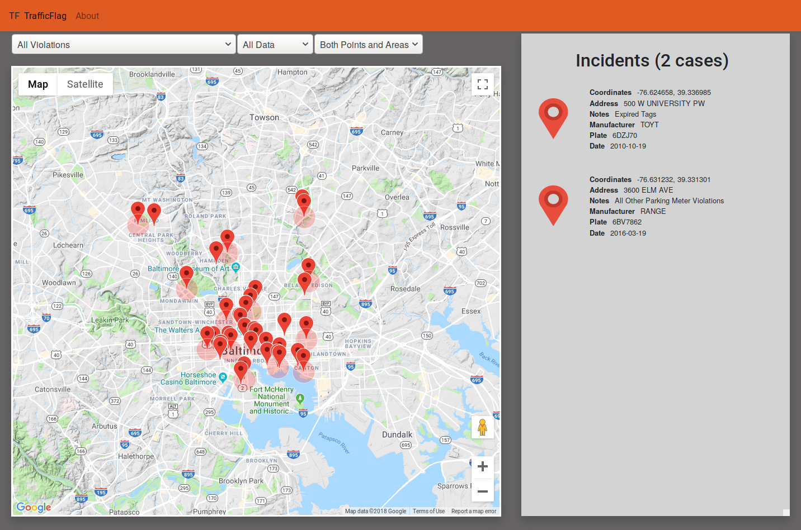
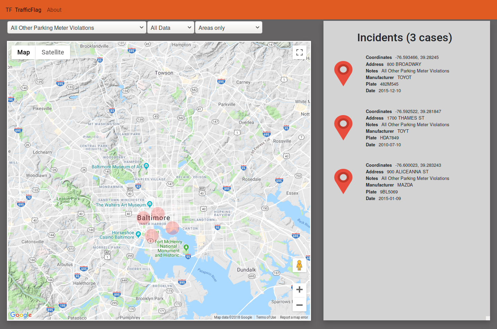
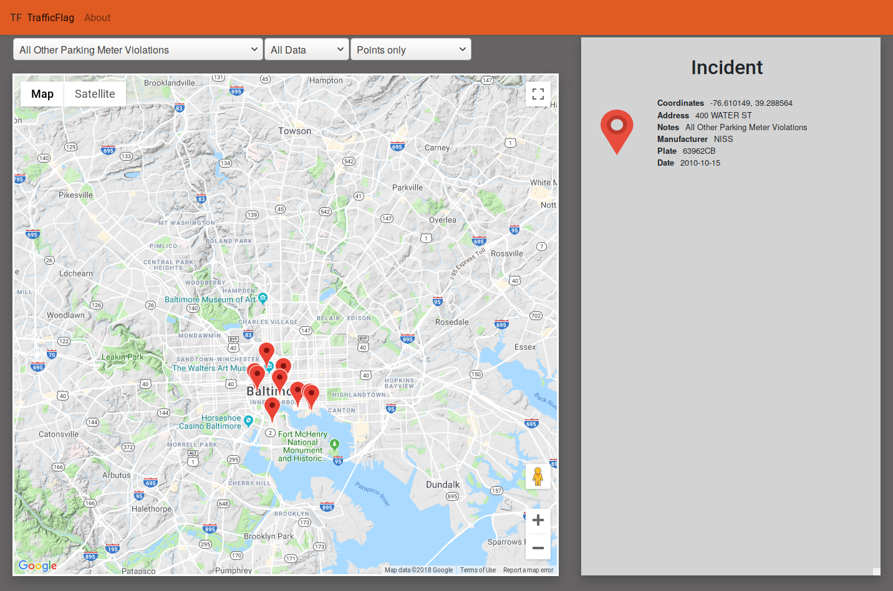

# Traffic Flagger 

Our project won the Best Civic Hack and Best Use of Google APIs categories at [HopHacks Fall 2018](https://www.hackerearth.com/challenges/hackathon/hophacks-fall-2018/)! A big thank you to the organizers and sponsors of this hackathon :smiley:

## Why?
The purpose of Traffic Flag is to improve efficiency of police presence in Baltimore. Through clean and organized view of previous citation data, officers can have a good understanding of hot spots around the city and focus on such areas with future patrols. With data presented in a visually easing manner, it enables a much easier experience for officials to analyze and conclude patrol routes and prevention plans.

## Technologies Used
We used the Google Maps API to plot citations and display hotspots. The whole project used Google AppEngine for the backend and Google Cloud Datastore to store login information. 

## How it works

### Dropdown Menus

**Type of Violation** We performed some preliminary analysis on the dataset to extract unique types of violations and used this list to populate the dropdown. This allows the user to focus on particular types of violations depending on what problem they're trying to solve. 

##### Recency
Users can choose the recency of the data they want to have displayed. The data set given by the organisers spanned more than a decade, so if the user wanted a more recent time range such as the past 6 month, the past month etc. they are able to filter the relevant data.

##### Type of Marker
Users have the option to see points only, areas only or both. 

### Types of Points

##### Points
In the provided dataset, each row records a traffic violation and Points in our application refers to one of these violations. When they are clicked, only one incident's information is shown ([Fig. 3](#user-content-fig-3-only-showing-points-of-parking-meter-violations)).

##### Areas
Areas are a collection of multiple incidents.If there are too many points with the same latitude and longitude, areas prevent the map from becoming too cluttered. This might be useful when users are interested in seeing which areas are the most problematic in the city. Currently, we set the clustering such that if incidents are within \~20m of each other, they are grouped in one area. When they are clicked, the incidents that fall within the area are shown ([Fig. 2](user-content-fig-2-only-showing-areas-of-parking-meter-violations))

## Screenshots 

### Fig. 1: Showing all violations, all time, both areas and points

### Fig. 2: Only showing areas of parking meter violations (clicked on an area)

### Fig. 3: Only showing points of parking meter violations (clicked on a point)

